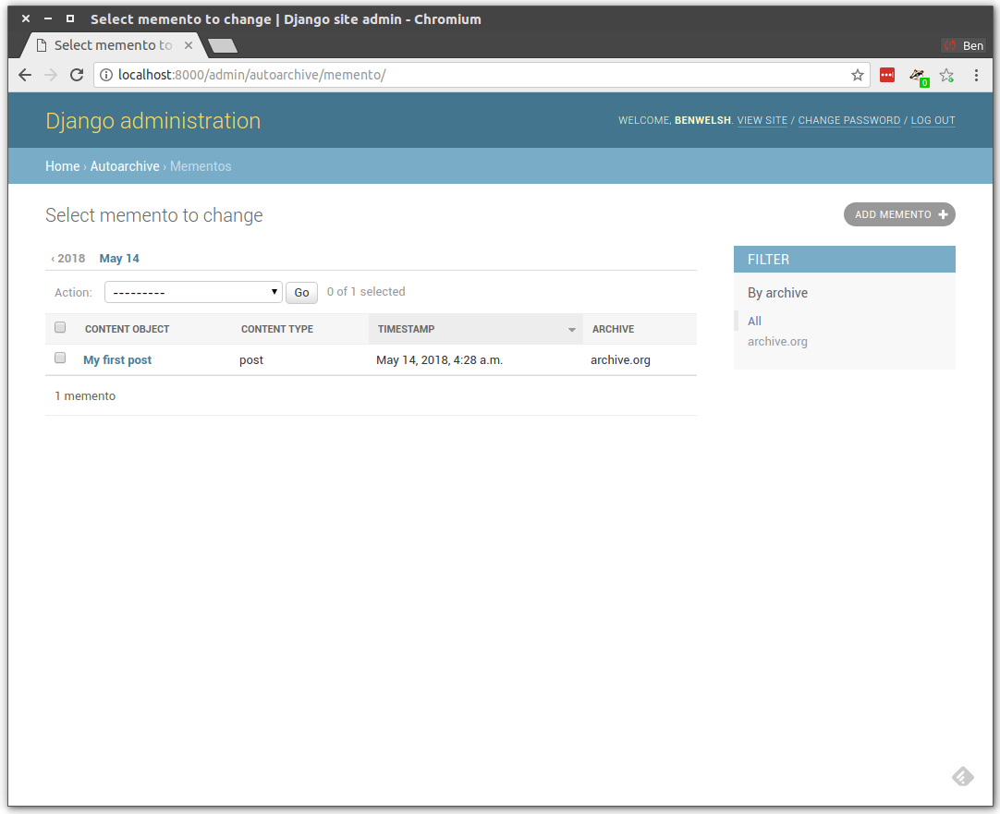
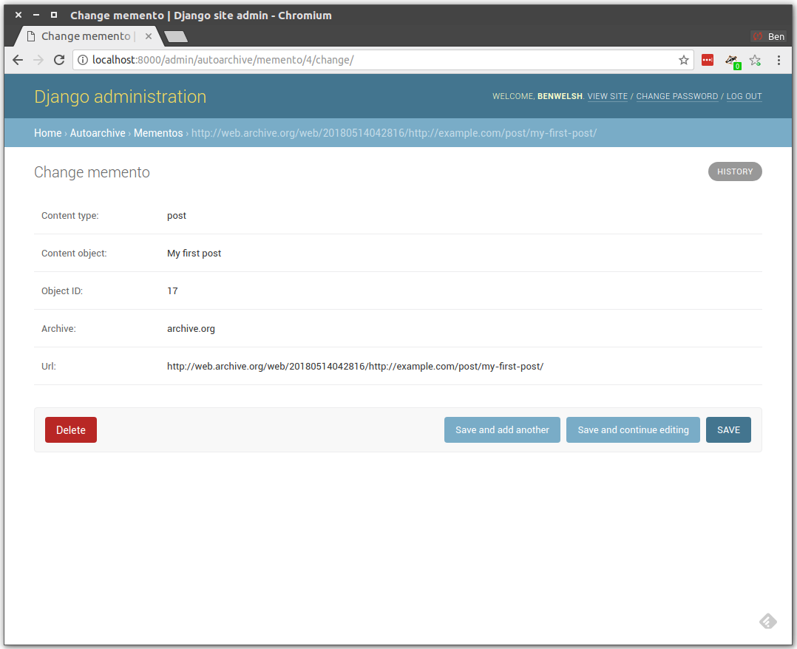

# django-autoarchive

Django helpers for automatically archiving URLs


### Here's the idea

Install this Django app. Hook it to a model. Do a little bit of config. Each time you save an object, its URL will be archived at [The Internet Archive's Wayback Machine](http://archive.org).

### Don't get any big ideas

This is a proof of concept developed in response to some [interesting Twitter conversations](https://twitter.com/palewire/status/995809746878787584) about how online news organizations can more aggressively archive their work.

That means it is not perfect. Things it should do yet:

1. Hand the archiving off to a background task runner like Celery.
2. Support other online archives like [archive.is](http://archive.is).
3. Surface archived mementos on the admin page of enabled models.
4. Have tests and continuous integration and all that adult stuff.

### How to try it out

Install the app into a Django project.

```bash
$ pip install django-autoarchive
```

Add it to the project's `INSTALLED_APPS` setting.

```python
INSTALLED_APPS = [
    # ... your stuff above here ...
    'autoarchive'
]
```

Migrate to build tables.

```bash
$ python manage.py migrate
```

Choose a Django model you'd like to begin archiving. Have it inherit from this app's base `AutoArchiveModel`. Here's an example:

```python
# -*- coding: utf-8 -*-
from __future__ import unicode_literals
from django.db import models
from autoarchive.models import AutoArchiveModel


class Post(AutoArchiveModel):
    """
    A blog post.
    """
    headline = models.CharField(max_length=500)
    slug = models.SlugField(unique=True)
    publication_date = models.DateField()
    is_published = models.BooleanField(default=False)
    body = models.TextField(blank=True)

    class Meta:
        ordering = ("-publication_date",)
        get_latest_by = "publication_date"

    def __str__(self):
        return self.headline

    def get_absolute_url(self):
        return '/post/{}/'.format(self.slug)
```

Try it out by creating a new object.

```python
>>> Post.objects.create(
    headline="My first post",
    slug="my-first-post",
    publication_date=datetime.now(),
    is_published=True
)
```

Boom. That's it. If you visit your admin you'll see the Memento has been created at the Internet Archive.





Save again and it will create another one. And again. And again.

### More stuff to know

You can override `get_archive_url` on the model to have it return any field or generated value to be sent to the Internet Archive. There's also some bits in here to prevent unpublished objects from being sent to the archive. Right now you'll have to read [the source code](https://github.com/pastpages/django-autoarchive/blob/master/autoarchive/models.py) to better understand those options. But it's not much. I promise.
